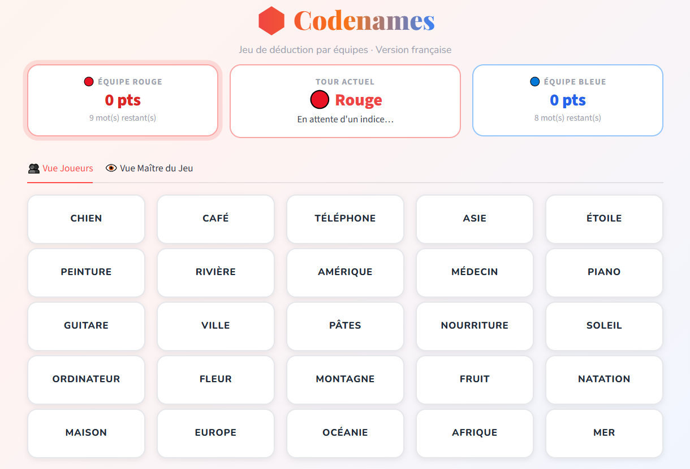
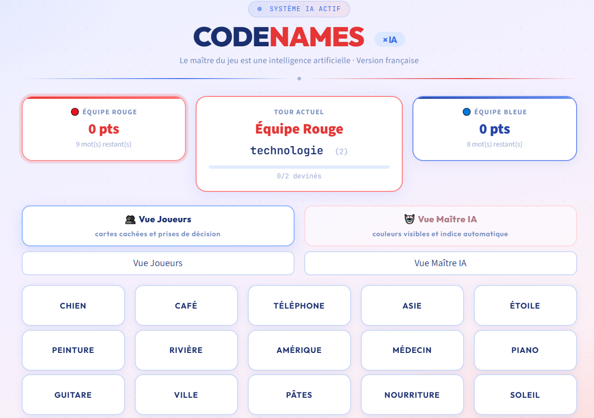
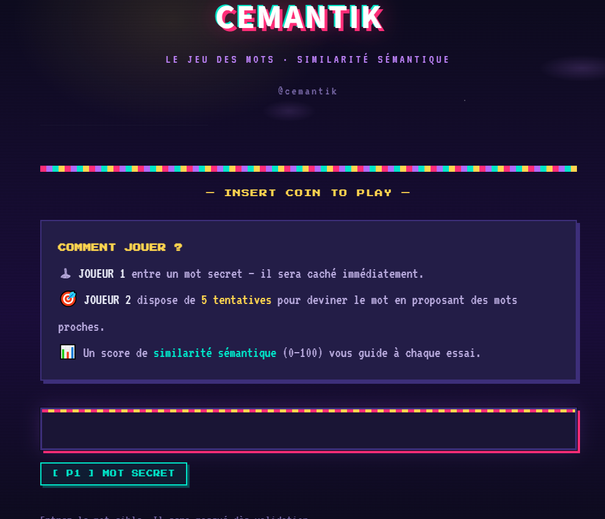
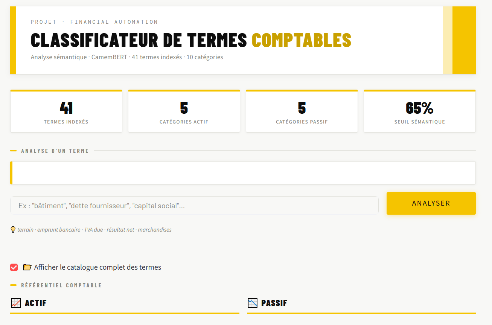
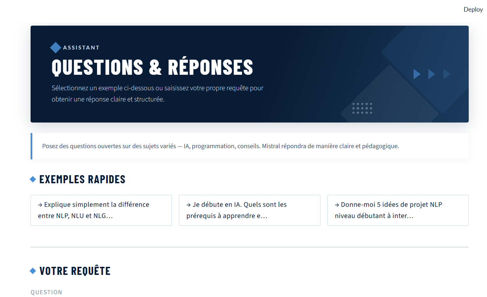
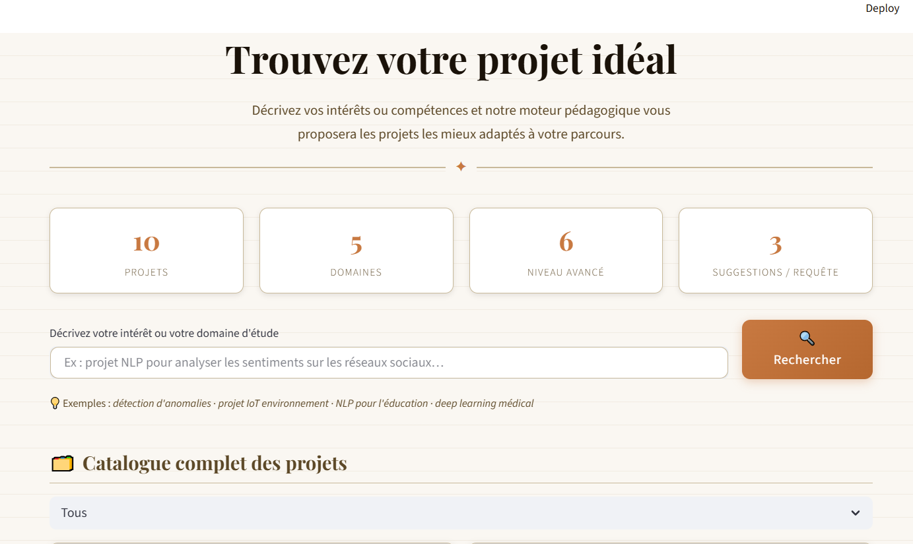

<div align="center">

# 🧠 TP-NLP

**Explorations interactives du traitement du langage naturel**

[](https://python.org)
[](https://streamlit.io)
[](https://huggingface.co)
[](https://mistral.ai)

*Jeux linguistiques · Embeddings · Modèles génératifs · Recherche sémantique*

---

</div>

## 📖 À propos

**TP-NLP** est une suite d'applications Streamlit qui illustrent les grands concepts du NLP de façon interactive. Du jeu de devinette sémantique à la génération de texte par LLM, en passant par un pipeline RAG complet — chaque page est une démonstration autonome, conçue pour explorer et comprendre par la pratique.

---

## 🚀 Démarrage rapide

```bash
# 1. Installer les dépendances
pip install -r pages/requirements.txt

# 2. Lancer l'application
streamlit run pages/app.py
```

> **Astuce :** Certaines pages utilisent l'API Mistral. Ajoutez votre clé dans un fichier `.env` à la racine :
> ```
> MISTRAL_API_KEY=votre_clé_ici
> ```

---

## 🗂️ Structure du projet

```
TP-NLP/
├── pages/
│   ├── app.py              ← Point d'entrée & navigation
│   ├── code_names.py       ← Codenames classique
│   ├── AI_code_names.py    ← Codenames avec IA
│   ├── cemantik.py         ← Jeu sémantique
│   ├── encoder_bert.py     ← Classification BERT
│   ├── decoder_gpt.py      ← Génération Mistral
│   └── rag.py              ← Pipeline RAG
├── docs/images/
└── .env
```

---

## 🎮 Applications

### 🃏 Codenames — Version classique
> `pages/code_names.py`

Implémentation fidèle du célèbre jeu de société en français. Génère une grille de 25 mots, assigne les rôles (rouge, bleu, neutre, assassin) et gère les tours des deux équipes avec une vue séparée pour les joueurs et le maître du jeu.

**Technologies :** `random` · `st.session_state`



---

### 🤖 Codenames — Version IA
> `pages/AI_code_names.py`

L'IA joue le rôle du maître du jeu. Elle génère automatiquement un indice sémantique pour l'équipe courante, évalue les risques (mots adverses, neutres, assassin) et propose une assistance par clustering des mots proches.

**Technologies :** `SentenceTransformer("all-MiniLM-L6-v2")` · similarité cosinus · `AgglomerativeClustering`



---

### 🧩 Cemantik — Devinette sémantique
> `pages/cemantik.py`

Jeu à deux joueurs : le Joueur 1 choisit un mot secret, le Joueur 2 dispose de **5 tentatives** pour le deviner. À chaque essai, un score de similarité sémantique (0–100) guide la progression.

**Technologies :** `CamembertModel` · `camembert-base` · similarité cosinus



---

### 🔍 Encodeur BERT — Classification comptable
> `pages/encoder_bert.py`

Interface de classification de termes comptables inspirée d'un encodeur BERT. Tente d'abord une correspondance exacte, puis calcule une similarité sémantique avec une base de termes structurés en *actif* et *passif*. Retourne la catégorie la plus proche si le score dépasse **0.65**.

**Technologies :** `CamembertModel` · `camembert-base` · similarité cosinus



---

### 💬 Décodeur GPT — Assistant génératif
> `pages/decoder_gpt.py`

Interface assistant alimentée par l'API Mistral, proposant trois modes d'utilisation :

| Mode | Description |
|------|-------------|
| 💬 Chat / Q&A | Questions ouvertes sur n'importe quel sujet |
| 📄 Résumé | Synthèse structurée d'un texte long |
| 💻 Code | Génération de Python exécutable et commenté |

**Technologies :** `mistralai` · `mistral-tiny`



---

### 🔎 RAG — Recommandation de projets
> `pages/rag.py`

Pipeline RAG (*Retrieval-Augmented Generation*) complet pour recommander des projets académiques. Encode un catalogue de projets en embeddings, construit un index FAISS, récupère les entrées les plus proches d'une requête, puis demande à Mistral de générer une recommandation contextualisée.

**Technologies :** `paraphrase-multilingual-MiniLM-L12-v2` · `faiss.IndexFlatL2` · `mistral-small-latest`



---

## 🧬 Modèles utilisés

| Application | Modèle / Méthode | Tâche |
|-------------|-----------------|-------|
| `cemantik.py` | `camembert-base` | Similarité sémantique entre mots |
| `encoder_bert.py` | `camembert-base` | Classification comptable par similarité |
| `decoder_gpt.py` | `mistral-tiny` | Chat · résumé · génération de code |
| `rag.py` | `MiniLM-L12-v2` + `mistral-small` + FAISS | Retrieval + génération augmentée |
| `AI_code_names.py` | `all-MiniLM-L6-v2` | Génération d'indices sémantiques |
| `word2vec.py` | `Word2Vec` CBOW / Skip-Gram | Apprentissage d'embeddings |
| `rnn_lstm.py` | `RNN` / `LSTM` | Prédiction du mot suivant |
| `preprocessing.py` | `fr_core_news_sm` + NLTK | Prétraitement linguistique |
| `image_generation.py` | `Stable Diffusion XL` | Génération d'image |

---

## 📦 Dépendances principales

```
streamlit
transformers
torch
sentence-transformers
faiss-cpu
mistralai
scikit-learn
python-dotenv
spacy
nltk
diffusers
```

---
